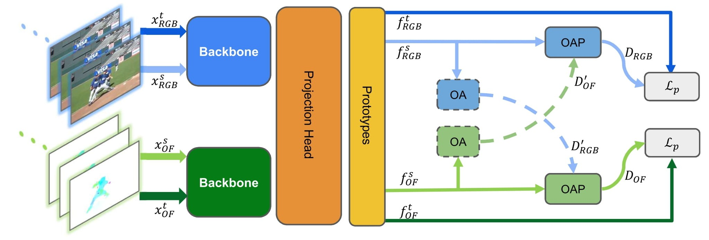

# GOCA
Guided Online Cluster Assignment for Self Supervised Video Representation Learning. 
<br>
<sub>Official PyTorch Implementation of the ECCV 2022 Paper. Feel free to contact with hcoskun-at-snap.com if you have have questions.</sub>

## Overview
We propose a principled way to combine two views. Specifically, we propose a novel clustering strategy where we use the initial cluster
assignment of each modality as prior to guide the final cluster assignment of the
other modality. This idea will enforce similar cluster structures for both modalities, and the formed clusters will be semantically abstract and robust to noisy
inputs coming from each individual modality. You can find implementation of this idea in [sinkhorn_withprior](https://github.com/Seleucia/goca/blob/main/helper/train_utils.py#L210)

### Link: 

[[Arxiv]](https://arxiv.org/abs/2207.10158)

## Prerequisites
* Python 3.7
* PyTorch==1.4.0, torchvision 0.5.0
* Cuda 10.2
* Apex with cuda extension (see also: [this issue](https://github.com/facebookresearch/swav/issues/18#issuecomment-748123838))

### Preparing Dataset
1. Download dataset ```sh datasets/ds_prep/kinetics-400/download.sh```
2. Extract rar files ```sh datasets/ds_prep/kinetics-400/extract.sh```
3. We use TVL1 algorithm to compute optical-flow.  We modified the [MemDPC Code](https://github.com/TengdaHan/MemDPC/blob/master/process_data/src/extract_ff.py) for efficient GPU utilization to compute optical flow.
    1. Run this script `python datasets/ds_prep/efficent_optical_flow_with_GPU.py`
    2. If you have more than one-GPU to dedicate to compute optical flow, you can run this script for your each GPU.
    3. Unfortinatly, I couldn't find a way to batch-wise optical flow computation with open-CV. If you can manage it, please let me know.
  
### Pretrain Instruction

1. Generate prototypes 
` python prots/prototypes.py`
    1. It will save the prototypes to "prot/fls/" and model will load from there. If you save another location please update "helper/opt_aug.py".
    2. Please be sure that use_precomp_prot set true other-wise model will use randomly generated prototypes.
    3. Trained prototypes should look like Figure 3 (on the right) in the paper. 

2. Run pre-training: `sh scripts/pretrain_on_cluster.sh`
    1. Above script is for multi-node slurm training, however code can be used for single node training as well.
    2. Please setup your dataset location in ".sh" file or in "helper/opt_aug.py" file.


### Nearest-neighbour Retrieval Instruction

You can use following script for evaluation. You need to be sure that "root_dir" argument is correctly set.
```
 sh scripts/knn_on_cluster.sh
```
please update "root_dir" for your computed features. Model generate features during evaluation stage. You can set where to save in the 

## Acknowledgements
We used code from [Selavi](https://github.com/facebookresearch/selavi), [SWaV](https://github.com/facebookresearch/swav), [VICC](https://github.com/martinetoering/ViCC), and [CoCLR](https://github.com/TengdaHan/CoCLR)

## Notes On Code
 * We are still cleaning the code, because of this maybe you might see some un-used methods in the code, please ignore them. 
 * We experimented training with float-16, however we observe significant drop in accuracy. We couldn't solve this problem. Ideally, accuracy shouldn't change that much. If anyone interested in with this code, we can provide that also. 
 * Please becareful with the open-cv implementation for optical flow. We observe that there can be significant differences at computed the optical flows.
   * We extract optical flow with at the image-size of 256
   * You should use same parameters to extract optical flow for all the datasets.
 * We did our best to follow comon evaluation strategies however there are differences in earlier works. We mostly follow: [A Large-Scale Study on Unsupervised Spatiotemporal Representation Learning
](https://arxiv.org/abs/2104.14558). We saw most of the works follow it, however we observe following differences: 
    * For instance, CoCLR and VICC uses different learning rate-scheduler during fine-tuning.
    * We observe differences in fine-tuning duration. 
    * Selavi uses different features (extracted from different layer with embedding size of 4096) for evalaution than others. In our experiment we use 2048 for all. We did not see significant difference with 4096. 
    * We also observe that number of projection layer changes significantly in earlier works.  
    * We observe also significant differences in optimizers and learning-rate scheduler during pre-training. 
    
## Citation
```
@inproceedings{gocaweakly,
  title={GOCA: Guided Online Cluster Assignment for Self Supervised Video Representation Learning},
  author={Huseyin Coskun and Alireza Zareian and Joshua L. Moore and Federico Tombari, and Chen Wang},
  booktitle={ECCV},
  year={2022}
}
```
